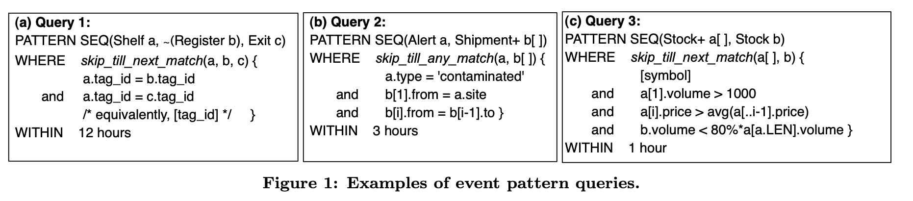
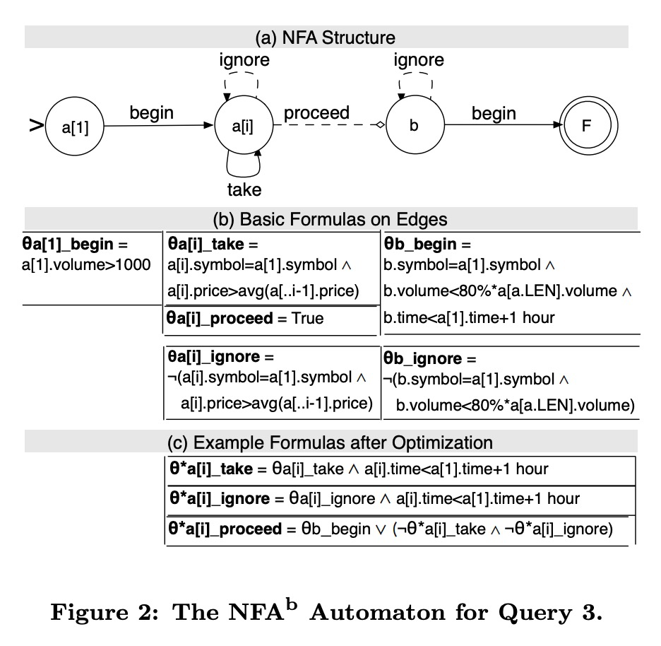
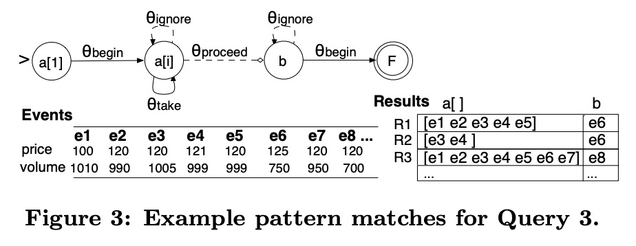
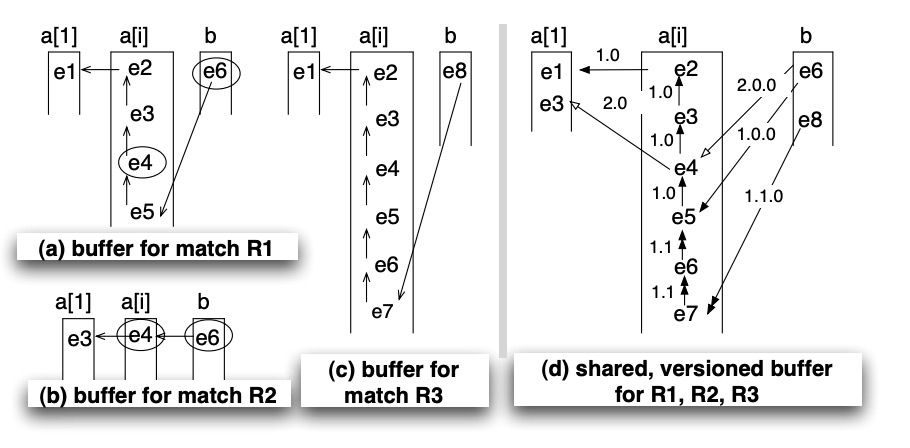
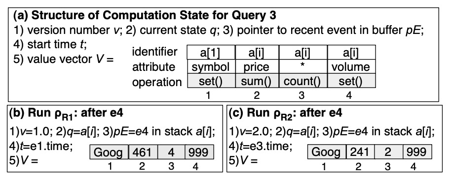
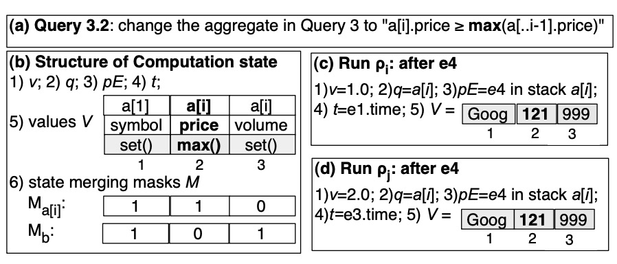
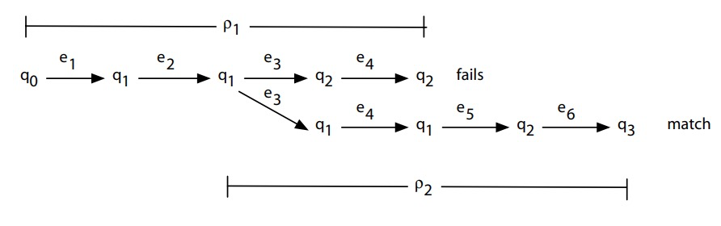
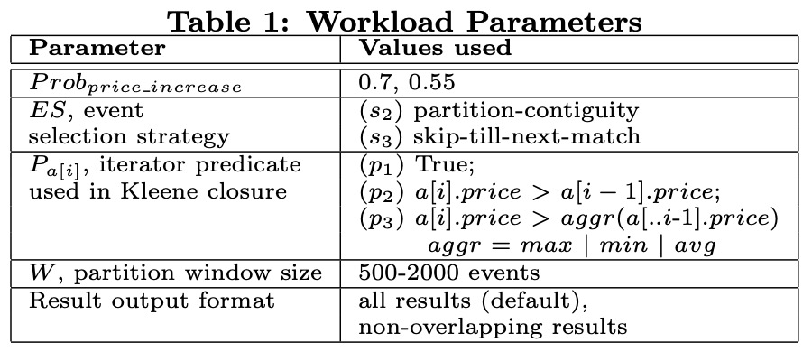
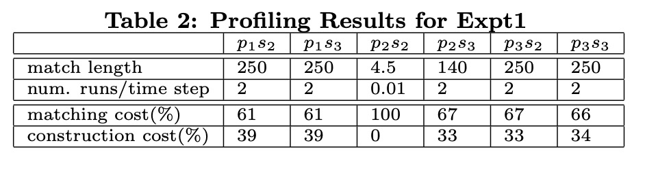
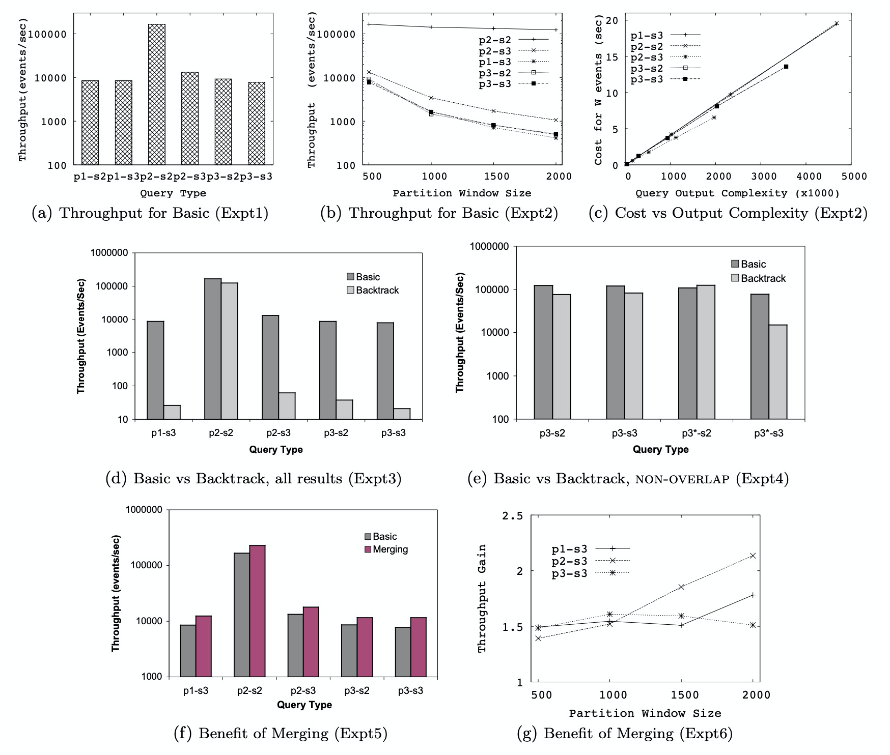

# Efficient Pattern Matching over Event Streams(事件流上的高效模式匹配)

* Jagrati Agrawal，
* Yanlei Diao，
* Daniel Gyllstrom
* Neil Immerman计算机科学系马萨诸塞大学阿默斯特分校美国马萨诸塞州阿默斯特{ jagrati，yanlei，dpg，immerman } @ cs.umass.edu

## 抽象

事件流上的模式匹配越来越多受用于许多领域，包括金融服务，RFID-基于库存管理，点击流分析和电子电子健康系统。而正则表达式匹配经过充分研究，流上的模式匹配呈现两个新挑战：用于流模式匹配的语言比正则表达式的语言要丰富得多。此外，对这些模式的有效评估通过流查询需要新的算法和优化位置：流查询处理的常规知识（即使用选择联接聚合）是不够的。

在本文中，我们提出了一个正式的评估模型，为此类新查询提供了精确的语义，查询评估框架允许在有原则的方式。我们使用此模型进一步分析查询的运行时复杂性，并开发一套技术，通过利用存储和处理中的共享来提高运行时效率。我们的实验结果提供了有关运行时性能各种因素的见解，并证明了我们共享技术的显着性能提升。

### 类别和主题描述符

H.2 [数据库管理]：系统

### 一般条款

算法，设计，性能，理论

### 关键词

事件流，模式匹配，查询优化

## 1.引言

事件流上的模式匹配是一种新的处理范例，其中连续到达的事件与复杂的模式进行匹配，用于匹配每个模式的事件被转换为新的事件以进行输出。确切地说，这种流上的模式匹配引起了信号由于行业[28，30，29，9]的广泛兴趣在金融服务[10]，RFID-基于库存管理[31]，点击流分析[26]，和电子卫生系统[16]。在金融服务中，例如，经纪客户可能对证券交易感兴趣代表新市场的股票交易事件的频率趋势。在基于RFID的跟踪和监视中，位置可能希望跟踪货运的有效路径并检测供应链中的食物污染等异常情况。尽管正则表达式匹配是一个经过充分研究的计算机科学问题[17]，但流上的模式匹配提出了两个新的挑战：

* 丰富的语言
  * 事件流[10，15]上的模式匹配语言比正则表达式匹配的语言丰富得多。这些事件模式语言包含用于表达排序，Kleene闭包，否定和复杂谓词的构造，以及从混合相关事件和不相关事件的输入流中选择相关事件的策略。Kleene闭包特别重要，可用于从输入流中提取具有特定属性的有限但无限制的事件数。如[15]所示，Kleene闭包与不同策略从输入流中选择事件的相互作用可能导致查询比正则表达式复杂得多。
* 流效率
  * 高效评估事件流上的模式查询需要新算法和优化。流的传统智慧查询处理已使用selection-join-aggregation查询[3、7、8、24]。尽管此类查询可以指定简单的模式，但它们本质上无法表达Kleene闭包，因为可能涉及的输入数量是先验未知的（我们将在本文中正式证明）。最近的研究[10，26，34]已经开始解决高效评估流中的模式查询。但是，建议的技术是针对各种受限条件而定制的模式查询和模式匹配结果集，例如不带Kleene闭包的模式[34]，仅在连续事件上的模式[26]和不输出完全匹配的模式匹配[10]。这项工作的目标是提供基本的评估-新型模式的优化和优化框架查询事件流。我们的查询评估框架偏离了经过充分研究的关系流处理其固有的局限性如上所述。进一步来说，我们的查询评估框架的设计基于三个原则：第一，评估框架应足以用于整套模式查询。二，给定如此全面的支持，应该高效率计算。第三，它应该允许原则上的优化。遵循这些原则，我们开发了一个数据流系统模式查询评估。

图1：事件模式查询的示例。

我们的贡献包括：

* 正式的评估模型: 我们提出了一个正式的查询评估模型NFAb，该模型将有限的状态机与匹配缓冲区结合在一起。该模型为事件模式查询的完整集合提供了精确的语义，允许进行原则上的优化，并生成可以在事件流上执行的查询评估计划。 NFAb模型还允许我们
分析其在关系流处理方面的可表达性，从而获得关于模式评估的充分性和效率的正式结果。
* 运行时复杂性分析: 基于NFAb的查询计划提出了新的抽象概念，我们确定了运行时评估中的关键问题，尤其是状态机执行中不同类型的不确定性。 我们进一步分析了这种查询评估的最坏情况的复杂性，从而为运行时优化带来了重要的直觉。
* 运行时算法和优化: 我们开发新的数据结构和算法，以评估基于NFAb的流查询计划。 为了提高效率，我们的优化在存储所有可能的模式匹配以及自动执行以生成这些匹配的过程中采用了积极的共享。

我们在一个基于Java的原型系统并评估基于NFA b使用一系列查询工作负载的查询计划。结果我们的绩效评估可洞察各种影响运行时性能并显示出重要意义我们共享技术带来的性能提升。在本文的其余部分安排如下。我们在本节中提供事件模式语言的背景. 我们描述了提到的三个技术贡献分别在第3节，第4节和第5节中。详细的性能分析结果显示在第6节。我们将在第7节介绍相关工作，并得出结论本文在第8节中对未来的工作进行了评论。

## 2.背景

在本节中，我们提供事件模式的背景语言，为讨论提供了技术背景在随后的部分中。

最近出现了许多模式语言提案，包括SQL-TS [26]，Cayuga [10、11]，SASE +[34，15]和CEDR [5](还有一些商业上的努力和标准化-行动计划[9，28，29]。这些语言的发展是仍在进行中。因此，本文不对其进行进一步讨论。)。尽管它们在语法上有所不同，这些语言通过事件流共享许多模式匹配功能。下面我们调查了使用SASE +语言进行模式匹配的关键特征，因为它比大多数其他语言都丰富[15]。 这种语言使用简单的事件模型：事件流是无限的事件序列，每个事件都代表某个时间点上感兴趣的事件。 一个事件包含其事件类型的名称（在模式中定义）和一组属性值。 每个事件还具有捕获其发生时间的特殊属性。 假定事件按照发生时间的顺序到达(我们建议的查询评估方法适用于乱序事件的扩展，如第8节所述。)

模式查询处理事件序列，这些事件序列在输入流中按顺序发生（不一定在连续位置），并根据其属性值进行关联。 图1显示了三个这样的查询。

查询1在基于RFID的零售管理中检测入店行窃活动[34]：它报告在货架上被拣出然后被带出商店而不被检查的物品。 pattern子句指定了一个序列模式，该序列模式包含三个部分：出现架子读取到取出，然后不出现Register读取，然后出现出口读取。未发生的事件，以“〜”表示，也称为否定

每个组件都声明一个变量以引用相应的事件。 where子句使用这些变量来指定单个事件以及多个事件的谓词（用“ {”}}对括起来）。 查询1中的谓词要求所有事件都引用相同的标签ID。 所有事件之间的这种相等比较称为等效性测试（简称为“ [标签ID]”）。 最后，该查询使用一个inner子句在整个模式上指定12小时的时间窗口。

查询2检测到食品供应链中的污染：它捕获有关受污染地点的警报，并在每次模式匹配中报告一系列独特的受感染货物。 在此，序列模式使用Kleene plus运算符来计算每个系列的货运（其中“ +”表示一个或多个）。 为Kleene plus组件声明了一个数组变量b []，其中b [1]指的是污染源发出的货物，b [i]指的是通过与前一个货物并置感染的每个后续货物。 谓词在何处清楚地说明了对装运的限制； 特别是，将b [i]与b [i-1]（i> 1）比较的谓词指定了每批货物与其前一货物之间的搭配条件。

查询3捕获了复杂的股票市场趋势：在过去一个小时内，股票的数量开始很高，但是在价格上涨或保持相对稳定的一段时间后，数量却直线下降。 该模式有两个部分，一个是股票事件的Kleene plus，其结果在a []中，另一个是单独的单个股票事件，存储在b中。a [1]上的谓词处理初始体积。 a [i]的谓词 （i> 1）要求当前事件的价格超过先前选择的事件的平均值（这些先前选择的事件用a [.. i-1]表示）。 这样，谓词就捕获了逐渐（不一定单调）的价格上涨趋势。 最后一个谓词将b与a [a.len]进行比较，其中a.len引用a []中的最后一个选定事件，以捕获最终的交易量下降。

除了结构和谓词外，还使用事件选择策略定义模式查询，该策略解决如何从混合相关事件和不相关事件的输入流中选择相关事件的方法。 查询中使用的策略在where子句中声明为一个函数，该子句将其所有谓词包含在其主体中，如图1所示。流应用程序的各种需求要求使用不同的策略：

* Strict contiguity(严格的连续性)。在最严格的事件选择策略中，两个选定的事件在输入流中必须是连续的。 在与字符串，DNA序列等匹配的正则表达式中，此要求是典型的。
* Partition contiguity(分区连续性)。上述进行放松后，两个选定的事件不必是连续的。 但是，如果在概念上根据条件对事件进行了划分，则下一个相关事件必须与同一分区中的上一个事件相邻。 等效测试（例如查询3中的[symbol]）通常用于形成分区。 但是，如果分区连续性的目的是检测价格上涨的总体趋势，尽管局部波动，但分区连续性可能不够灵活，无法支持 查询3。
* Skip till next match(跳到下一个匹配)。进一步的放松是完全消除连续性要求：所有无关事件将被跳过，直到读取下一个相关事件为止。 使用此策略，查询1可以方便地忽略在第一个货架读数与出口或寄存器读数之间出现的物料的所有读数。 同样，查询3可以跳过不满足定义趋势的值。 在许多实际情况下，此策略很重要，在这种情况下，输入中的某些事件是特定模式的“语义噪声”，应忽略该模式以使模式匹配继续进行。
* Skip till any match(跳过直到任何匹配)。最后，跳过，直到任何匹配通过进一步允许对相关事件采取不确定性行动来放松前一场匹配。 查询2说明了这种用法。 假设Kleene plus选择的最后一个货件到达位置X。当从输入流中读取相关货件（例如，从X到Y）时，跳过直到任何匹配有两个动作：（1）选择事件 一个执行实例以扩展当前序列，并且（2）在另一个实例中忽略该事件以保留Kleene闭合的当前状态，即位置X，以便可以识别以后的装运，例如从X到Z 作为相关事件，并可以实例化其他系列。 这种策略实质上是在相关事件到达时（例如三小时内所有受感染的货物）计算出污染传递关闭。

最后，模式查询的每个匹配项（例如，查询3的a []和b变量的内容）都将作为包含事件中所有事件的复合事件输出。 有两种输出格式[15，28]：默认格式返回模式的所有匹配项。 相反，非重叠格式仅在属于同一分区的匹配项中输出一个匹配项（为了严格邻接，将输入流视为单个分区）并且在时间上重叠。 也就是说，分区中的一个匹配只有在上一个匹配完成之后才开始输出。 语言支持也可用于计算复合事件的摘要，并通过将一个查询输出的事件作为输入提供给另一个查询来编写查询[15，28]。 这些附加功能不是本文的重点，可以很容易地插入下面提出的查询评估框架中。

## 3.正式语义模型

在描述了事件模式查询之后，我们将在本文的其余部分中研究它们的评估和优化。 在本节中，我们提供一个正式的评估模型，该模型为这种新型的模式查询（第3.1节）提供精确的语义。 我们还提供了编译算法，可以将模式查询转换为该模型中的表示形式，从而生成运行时使用的查询评估计划（第3.2节）。 此模型还使我们能够分析其与关系流处理有关的可表达性，从而获得关于模式评估的充分性和效率的正式结果（第3.3节）。

### 3.1评估模型：NFA b状态机(Non-determined Finite Automaton，不确定的有限状态机)

我们的查询评估模型采用一种新型的状态机，该模型包括一个不确定的有限状态机（NFA）和一个匹配缓冲区（称为NFAb）来表示每个模式查询。 形式上，NFAb状态机A =（Q，E，θ，q1，F），由一组状态Q，一组有向边E，一组公式θ，标记这些边，一个开始 状态q1和最终状态F。查询3的NFAb如图2所示。

**状态**。在图2（a）中，开始状态a [1]是匹配过程开始的地方。 它等待输入以启动Kleene plus并在Match缓冲区的a [1]单元中选择一个事件。 在下一个状态a [i]，它尝试选择另一个事件到缓冲区的a [i]（i> 1）单元中。 后续状态b表示匹配过程已满足Kleene plus（针对特定匹配），并准备处理下一个模式组件。 最终状态F表示过程的完成，从而导致模式匹配的创建。

总而言之，状态集Q被安排为线性序列，其中包括任意数量的单例状态s（对于非Kleene加分量）或状态对p [1]，p [i]（对于Kleene） 加上组件，再加上最右边的最终状态F。单例状态类似于ap [1]状态，但没有后续的p [i]状态。

**边缘**。每个状态都与许多边关联，这些边代表可以在该状态下执行的操作。 如图2（a）所示，成对的每个状态（单例状态或第一状态p [1]）都具有向前开始。 一对中的每个第二状态p [i]都具有前向前进边和循环乘边。 每个状态（除了开始状态和最终状态）都具有循环忽略边缘。 起始状态没有优势，因为我们只对从选定事件开始的匹配感兴趣。

-3 我们的NFA b 状态机与[10]。主要区别在于NFA b使用了额外的缓冲区以计算和存储完全匹配项并可以支持范围更广的查询的汇编（更多内容请参见§7）。

图2：用于查询3 的NFA b状态机。

用三元组精确描述状态q的每个边：（1）一个公式，指定取用该条件的条件，用θqedge表示；（2）对输入流的操作（即是否消耗事件） ），以及（3）对匹配缓冲区的操作（即是否写入缓冲区）。 边的公式是从模式查询中编译的，我们将在后面详细解释。 如图2（a）所示，我们用实线表示开始并取走从输入中消耗事件的边，然后将其写入缓冲区，用虚线表示ignore-edge并消耗事件但不将其写入缓冲区。Pocess-edge是一种特殊的E边缘：它不消耗任何输入事件，而仅计算其公式并尝试进行处理。 我们用箭头样式区分前进边和忽略边，表示其行为。

**非确定性**。当在某些状态下两个边的公式不互斥时，NFAb状态机可能会显示不确定性。 例如，如果θp[i]取值和θp[i]忽略不互斥，则我们处于不确定的跳过-任意匹配的情况。 重要的是要注意，这种不确定性源于查询。 NFAb模型只是它的真实翻译。

**NFA b运行**。NFAb状态机的运行由（1）已选择进入匹配缓冲区的事件序列（例如e3，e4和e6）唯一定义，（2）缓冲区中相应单元的命名，例如 查询3的a [1]，a [2]和b，以及（3）当前NFAb状态。 我们可以根据每次begin，take，ignore或process进行的移动归纳定义运行。 此外，接受运行是已达到最终状态的运行。 模式查询的语义是从其所有接受运行中精确定义的。 这些概念非常直观，为了节省空间，省略了详细信息

通过首先为没有子查询的NFA状态机创建NFAb状态机，然后组成这些状态机，对具有否定和查询组合的模式查询进行建模。 否定的语义尤其是嵌套查询的语义，如[34]中所提出。 例如，图1中的查询1首先识别参考相同标签的货架读数和出口读数； 然后，对于每对这样的读数，它确保在它们之间不存在相同标签的寄存器读数。 为了支持使用NFAb进行否定，我们首先计算仅包含正模式分量的NFAb状态机的匹配项，然后为每个负分量搜索NFAb状态机的匹配项。 后者的任何匹配都会从答案集中消除前者。

### 3.2使用NFA b进行查询编译

接下来我们提出自动的编译规则翻译简单的模式查询（无需取反或组合）位置）放入NFA b模型中。复合状态机否定或组合查询可以在以后构造通过严格遵循他们的语义。产生的代表将用作运行时评估的查询计划通过事件流。

**基本算法**。我们首先开发一个基本的汇编给出简单模式查询的算法，忠实于原始查询的NFA b状态机。在接下来，我们解释使用查询3作为算法的算法运行示例。
**步骤1**. NFAb结构：如图2所示，查询的pattern子句唯一确定其NFAb自动机的结构，包括所有状态和每个状态的边缘。 然后，该算法将查询的where和inside子句转换为NFAb边上的公式。
**步骤2**.谓词：算法以where子句开头，并使用谓词设置开始，采用和进行edge的公式，如图2（b）所示(为了简化演示，在此示例中，我们省略了事件类型检查。 这样的检查可以很容易地添加到边缘公式中。)。首先将所有谓词重写为合取范式（CNF），包括将等价检验[符号]扩展为规范形式，例如a [i] .symbol = a [1] .symbol。然后，根据它们的最后标识符的概念对它们进行排序。在这项工作中，我们将where子句中每次出现的变量称为标识符，例如查询3的a [1]，a [i]，a [a.len]和b。实例化了NFAb自动机中最新的一种。考虑这样一个合称“ b.volume <80％* a [a.len] .volume”。在标识符b和a [a.len]之间，b在以后的状态下实例化。排序后，该算法将每个合取词放在其最后一个标识符的实例化状态的边缘。在同时存在take和proce边缘的状态a [i]处，如果最后一个标识符为a [i]，则将合词放置在take边缘上，否则将其放在proceed边缘上（例如，标识符为a [a.len ]）。对于查询3，由于缺少最后一个标识符为a [a.len]的谓词，所以将进行边缘设置为True。
**步骤3**.事件选择策略：ignore-edge取决于所使用的事件选择策略。尽管存在多种策略，但模式查询可能使用，我们的算法确定忽略边的公式在状态q，θ q 忽视，在一个简单的，系统的方式：

* Strict contiguity(严格邻接)：false
* Partition contiguity(分区连续性)：¬（分区条件）
* Skip till next match(跳到下一个匹配)：¬（开始或开始匹配）
* Skip till any match(跳过直到任何一场匹配)：true

如上所示，当应用严格连续性时，θqignore设置为False，不允许任何事件被忽略。 如果使用分区连续性，则将θq ignore设置为分区定义的否定，从而可以忽略与分区无关的事件。 对于跳过直到下一场匹配，根据状态将θq ignore设置为否定开始或开始条件。 重新访问查询3。如图2（b）所示，在状态a [i]下将θa[i] ignore设置为¬θa[i] take，导致所有不满足take条件的事件都被忽略。 最后，为了跳过直到任何匹配，只需将θqignore设置为True，就可以忽略任何（包括相关的）事件。

**步骤4**.时间窗口：最后，在begin或process边缘到最终状态，算法将内部整个模式的条件。这种情况简直就是比较第一个与第二个之间的时差的谓词以及在指定的时间范围内最后选择的事件。优化。在我们的系统中，编译的原理是时间优化是为了推动停止和过滤条件尽早使用，以免时间和空间在不可行的状态机运行上浪费了。我们重点介绍几个以下优化：

**步骤5**：及早推动时间窗口：条件，当前位于F的最后边缘，可以是复制到所有采用，忽略并在较早状态开始的边。这样一来，一旦旧运行失败，就可以对其进行修剪。满足窗口约束。尽管数量增加所有边缘公式中的谓词，修剪非可行的运行早于谓语的轻微开销评价。图2（c）显示θa [i] 取和θa [i] 忽略后查询3的优化。

**步骤6**.约束行进edge：如果查询当前条件为True并且后续状态不是最终状态，则接下来优化行进边缘，这是查询3的情况。在状态a [i]处，此行进边缘会导致Take的不确定性（或忽略）边缘，从而为每个事件创建一个新的运行。为避免无法进行的运行，我们通过“偷看”当前事件并确定其是否满足下一个状态b的开始条件来限制前进。在否定的情况下，我们不允许继续进行。一个例外是，当a [i]处的take和忽略边都评估为False时，我们将允许机会转移到状态b，并让其决定下一步可以做什么。产生的θa[i]过程也显示在图2（c）中。重要的是要注意，尽管上面使用SASE +语言编写的模式查询[15]解释了我们的编译技术，但所有基本步骤（步骤1-4）和优化（步骤5-6）同样适用于其他模式语言[5，11，26]。

### 3.3 NFA b的可表达性

在本节中，我们将对NFA b模型的可表达性，而省略了形式为了空间的证明（可提供详细证明）在[1]中）。我们简要描述了集合D（NFA b）掌握NFA b可识别的流决策问题状态机。

命题3.1。D（NFAb ）包括以下问题对于不确定的空间日志n（NSPACE [log n]）已完成并且包含在通过阅读可以识别的问题集中从左到右一次NSPACE [log n]机器[32]。

命题3.1的第一部分证明的思想是，跳过匹配项查询中的单个Kleene plus就足以表示对NSPACE [log n]完整的有向图可达性。 查询2就是一个例子。 相反，NFAb从左到右读取一次其流，记录有限数量的字段，包括聚合，每个字段都需要O（log n）位。

图3：查询3的示例模式匹配。

我们还可以证明，任何布尔选择连接聚合查询（关系流系统主要关注的SQL子集）都在D（NFAb）中。 此外，众所周知，即使是聚合，一阶查询也无法表示图的可达性[21]。 因此，仅使用选择连接聚合无法表达查询2。 正式地，我们有 命题3.2。布尔选择-join-ag-的集合聚合查询以及常规语言中的查询集指标严格包含在D（NFA b）中。

最后，具有递归的完整SQL [4]表示流[18]上的所有多项式时间可计算查询，因此这是D（NFAb）的严格超集。 但是，该语言包含许多费用过高的查询，对于事件流上的模式匹配绝对是不必要的。

## 4.运行时的复杂性

介绍了查询评估模型和编译技术之后，我们接下来转到运行时引擎的设计，该引擎在事件流上执行基于NFAb的查询计划。 这些查询计划提供的新抽象及其评估的固有复杂性提出了重大的运行时挑战。 在本节中，我们将在第4.1节中描述这些挑战，并在第4.2节中提供运行时复杂性的分析结果。 下一部分将介绍我们用于有效查询评估的运行时技术。

### 4.1运行时评估中的关键问题

评估模式查询的运行时复杂度为反映为潜在的大量同时运行，其中一些可能会持续很长时间。

**同时运行**。作为一个具体的例子，考虑图2中的查询3及其在事件上的执行特定股票的交易流，如图3所示。两个拍子在e 6到达之后，生成匹配R 1和R 2的燕鸥匹配，并且在e 8之后创建包括R 3在内的另外几个。这三个匹配R 1，R 2和R 3在所包含的事件中重叠，这是由于在同一时间同时进行三个操作而产生的事件顺序。

有两个同时运行的来源。一个是事件序列从开始状态开始多次运行并且可以在较旧的运行完成之前开始较新的运行。例如，E 1和E 3在图3中都满足θ A [1] 开始并因此启动两个与R 1对应的重叠运行和R 2。一个更重要的来源是固有的非NFA b中的确定性，当来自同一状态的两个边并不互斥，如第3.1节所述。有四种类型的不确定性在NFA b模型中：

*Take-Proceed*。考虑由图1中的e 1启动的运行图3. 在状态a [i]处读取e 6时，此事件满足θa [i] 取和θa [i]都进行，导致行程除以采取两种不同的动作，后来又创造出两种不同重叠匹配R 1和R 3。此类进行的不定额交易术语本身是查询谓词的结果；它即使使用严格或分区连续性也可能发生。
*Ignore-Proceed*。当事件选择策略重新放松以跳至下一场比赛，忽略条件θa [i] 忽略如§3.2中所述，也放松了。在这种情况下，如果θa [i] 忽略并且忽略，则会出现忽略引起的不确定性θ A [1] 进行不是排他性的，如在查询3的情况。
*Take-Ignore*。当跳过直到使用任何匹配项时，θa [i] 忽略设置为True。然后，无视不确定性可以出现在a [i]状态。
*Begin-Ignore*。同样，当跳过直到使用任何匹配项时，开始忽略的不确定性可以出现在任何单例中状态或Kleenu plus对的第一个状态。

**运行的持续时间**。运行的持续时间主要是由使用中的事件选择策略确定。什么时候使用连续性要求，平均持续时间运行时间较短，因为读取后运行立即失败第一个违反连续性要求的事件。在没有连续性要求，但是，运行可以通过忽略无关事件而在每个州停留更长的时间，而等待下一个相关事件。特别是对于那些不产生匹配的跑步，他们可以继续循环通过忽略传入事件直到时间窗口来进入状态查询中指定的时间到期。

### 4.2复杂度分析

为了对运行时复杂性进行正式分析，我们介绍了包含所有运行需要考虑的特定分区中的事件。令T为查询中指定的时间窗口，令C为是可以具有相同事件的最大事件数时间戳记。还假设事件的一部分是-到特定分区的长度是p（在特殊情况下，严格连续性将输入流视为单个分区，因此p = 100％）。然后，分区窗口的大小W可以使用TCp进行估算。

以下两个命题计算先验最差-模式的运行次数的大小写上限查询可以。本文省略了证明。的有关证据的详细信息，请参考[1]。

命题4.1。给定运行ρ到达状态NFA b状态机中一对的p [i] ，令r p [i]（W）为可以在状态p [i]处从ρ分支的运行ber阅读W事件。r p [i]（W）的上限取决于存在的不确定性的类型：（i）进行不确定性，任何情况下都可能发生事件选择策略，允许运行分支到多个W中最多线性的方式（ii）忽略进行的不确定性，跳过可允许以下情况：直到下一场比赛或跳过直到任何一场比赛，也可以让以多种方式分支，至多为W。（iii）跳过任何内容，都可以忽略不确定性匹配，允许运行以多种方式分支W中的指数。

命题4.2。给定一个运行ρ，ton状态s或NFA b au-中对的第一个状态p [1]Tomaton，它在阅读时可以分支的方式数量W个事件（r s / p [1]（W），当跳过至使用any-match，否则为1。给定NFA b状态机，其状态为q 1，q 2，...，q m = F，可以从给定事件e开始的运行次数，〜r e随可分支的运行次数而增长在每个状态机状态下（最终状态除外）。那是，〜r e = r q 1（W 1）r q 2（W 2）... r q m-1（W m-1），其中W 1，W 2，...，W m-1是在状态q 1处读取的事件数，q 1，...，q m-1和Σm -1i = 1r q i（W i）=W。ously，〜R ē ≤| 最大m-1i = 1r q i（W i）|m−1。然后所有的运行可以从一系列事件的起始E 1，...，E W¯¯最多W | 最大m-1i = 1r q i（W i）|m−1。遵循建议4.2和4.2，我们在总数上有以下上限查询运行次数：

推论4.3。如果没有跳过任何比赛，一个查询可以运行的次数最多为poly-分区窗口W中的标称值，其中指数为受状态机中状态数的限制。在里面跳过直到出现任何匹配，运行次数可以是在W中最多为指数。这些最坏的情况表明，幼稚的方法单独运行这些工具可能不可行。在同级特别是，每次运行都会产生存储部分内存的内存成本或在缓冲区中完全匹配。其加工成本包括计算公式并为每个输入进行转换的过程事件。显然，如果运行次数很多，处理单独运行的幼稚方法将招致在存储和处理方面的开销过高。

**分享的重要性**。高效处理的关键是为了在存储和处理之间共享共享多次长期运行。我们的数据结构和算法支持共享的rithms，包括共享的匹配缓冲区描述了所有运行和处理中的合并运行下一节将详细介绍。在下面，我们注意两个跨运行共享的重要好处。

*在可行和不可行的运行之间共享*。可行的运行达到最终状态并产生匹配项，而非可行的运行会持续一段时间，但最终会失败。效果可行运行与非可行运行之间的主动共享允许从总成本中减少存储和处理成本运行次数到查询的实际匹配数。当大多数查询无法运行时，这样的共享可能是巨大的。
*在可行的运行之间共享*。分享可能会进一步发生-补间运行产生匹配。如果这些运行过程和存储相同的事件，可以在某些情况下应用共享narios将存储和处理成本降低到更少而不是可行的运行需要集体进行。这是-当大多数运行可行时，这一点尤为重要，匹配次数接近总运行次数。

**应付产出成本**。输出查询匹配项的成本与匹配项数成线性关系。 如果查询产生大量匹配项，即使使用共享可以更有效地检测到这些匹配项，输出成本也很高。 为解决此问题，我们支持两种输出模式，供应用程序根据匹配的用途和运行时效率的要求进行选择。 详细模式会枚举所有匹配项，然后分别返回它们。 因此，应用程序必须为此付出固有的费用。 压缩模式以紧凑的数据结构（尤其是我们用于为所有运行实现共享匹配缓冲区的数据结构）返回一组匹配项（例如，以同一事件结束的匹配项）。 一旦提供了解压缩算法，即从紧凑数据结构中检索匹配项的算法，诸如可视化工具之类的应用程序就可以灵活地决定检索哪些匹配项以及何时检索它们。

图4：为Q3创建共享版本缓冲区。

## 5.运行技术

基于从以前的分析中获得的见解，我们设计了适用于基于NFAb的查询计划的新抽象的运行时技术。 特别地，我们应用于运行时优化的原理是在基于NFAb的查询评估中跨多个运行共享存储和处理。

### 5.1共享的版本匹配缓冲区

第一种技术构造具有紧凑en-的缓冲区对所有运行进行部分和完全匹配的编码。我们首先描述单个运行的缓冲区实现，然后介绍一种将这些缓冲区合并为一个在所有跑步中共享一个。

图4（a）-（c）中描述了各个缓冲区图3中的三个匹配项。每个缓冲区包含一个se-堆栈，每个状态（最终状态除外）各一个。每堆栈包含指向事件（或简短事件）的指针触发了从此状态开始或采取行动，因此被选择进入缓冲区。此外，每个事件都有一个预设-上一个指针，指向先前选择的事件同一堆栈或上一个堆栈。添加事件时到缓冲区，其指针被设置。对于任何触发的事件-过渡到最终状态，在缓冲区中遍历从该事件沿着前任指针检索完全匹配。

接下来，我们将各个缓冲区合并为一个共享的缓冲区一种避免大量堆栈和复制的开销他们中的事件。此过程基于合并正确的单个缓冲区的堆栈，特别是合并这些堆栈中的相同事件，同时保留其预后代指针。在此过程中应格外小心，然而。如果我们盲目地合并事件，则遍历沿所有现有指针的共享缓冲区会产生错误新的结果。假设我们合并R 1的缓冲区通过合并a [i]堆栈中的e 4和b堆栈中的e 6来合并R和R 2。从e 6遍历可以产生一个由e 1组成的匹配，e 2，e 3，e 4和e 6，这是错误的结果。出现这个问题当合并过程无法将指针与不同的缓冲区。

为了解决这个问题，我们设计了一种技术共享版本缓冲区。它将版本号分配给每次运行并使用它来标记在此创建的所有指针跑。问题是运行没有预先指定的版本数字，因为任何状态的不确定性都会产生新的运行。在此技术中，对版本号进行编码作为一个杜威数字，以id 1（.id j）* （1≤j≤t ），其中t表示当前状态q 牛逼。直观地说，这意味着此运行来自ID 日1个从开始状态开始，而id 日Ĵ分裂的实例从到达状态的运行中确定状态q j，我们称之为祖先奔跑。这种技术还可以保证确定运行的版本号v与其祖先运行的v，采用以下形式之一：（i）v包含v作为前缀，或者（ii）v和v仅在最后一位数字t上有所不同v的id t大于v的id t。

图5：Q3的运行计算状态。

结合了三个匹配项的共享版本缓冲区如图4（d）所示。来自个人的所有指针现在，缓冲区已标记有兼容的版本号。上述错误结果不再发生，因为-使指针从e 6到e 4并带有版本号2.0.0与从e 4到e 3的指针不兼容（在a [i]堆栈），版本号为1.0。

可以看出，版本缓冲提供了紧凑的编码所有比赛。特别是事件和指针具有兼容版本号的版本构成了版本化视图恰好对应于一场比赛。返回比赛通过运行产生的，检索算法将杜威运行次数，并从最远开始遍历沿兼容指针的最后堆栈中的最近事件。此过程与从中检索匹配项一样有效一个单独的缓冲区。

### 5.2 NFA b执行多次NFA b的每次运行分两个阶段进行

在模式匹配阶段，它会过渡到最终状态并在选择事件时扩展缓冲区。在比赛中构建阶段，它检索由此产生的匹配项从缓冲区运行，如上一节所述。我们在本节中的讨论重点在于提高效率的算法模式匹配。

#### 5.2.1基本算法

我们首先寻求一种解决方案来评估单个运行尽可能有效。我们的解决方案基于以下概念运行的计算状态，包括最小集将来评估边缘公式所需的值。汇整查询3。在状态a [i]下，汇整的评估edge需要值avg（a [.i-1] .price）。缓冲区可以用于根据所包含的事件计算此类值，但它可能并不总是有效的。我们折衷一点通过创建一个小的数据结构来提高性能空间与缓冲区分开保持计算状态。图5（a）显示了计算状态的结构用于查询3。它具有五个字段：1）a的版本号运行，2）运行所在的当前状态机状态，3）指向缓冲区中选择的最新事件的指针在此运行中，4）运行的开始时间，以及5）向量V包含未来边缘评估所需的值。特别地，向量V由一组列定义，每个捕获一个值用作实例化变量在一些公式评估中。

重新查看图2中的公式。我们提取变量从所有公式的正确操作数实例化，并通过实例化状态将它们排列为V，然后属性，最后是操作。例如，1 日图5（a）中V向量中的列表示为a [1]选择一个事件，存储其符号以供以后评估等效测试。的2 次和3 次列共同计算每个的运行汇总avg（a [.i-1] .price）：为[i]选择的事件，第二列检索其价格，更新运行总和，而3 次列保持运行计数。4 所列存储的体积最后选择a [i]来评估涉及b的公式。

对于每次运行，都使用动态数据结构来捕获当前的计算状态。图5（b）和5（c）描绘了两次运行的计算状态ρ R1和ρ R2的NFA的b查询3。它们显示的状态分别对应于R 1和R 2在阅读图3中的事件e 4之后。

当新事件到来时，每次运行都会执行许多任务。它首先通过以下方法检查当前状态的边缘使用V向量和起点评估其公式运行时间。该状态可以有多个边（例如，在状态a [i]）上采取，忽略和进行边缘处理，以及任何其中的一部分可以评估为True。如果没有满足边缘公式，运行失败并正确终止远; 这种终止的常见情况是无法满足查询指定的时间窗口或连续性要求。如果满足多个边缘公式，则运行拆分通过克隆一两个子运行。然后每个结果运行（无论是旧运行还是新克隆的运行）都需要执行相应操作-自动移动，如果当前事件选择到缓冲区采取或开始采取行动，并更新其计算相应地陈述。

最后，我们改进了基本算法时的非使用§2中所述的重叠输出格式。回顾此格式仅输出属于到同一分区并在时间上重叠。既然我们做不知道先验先验在活跃者中运行特定分区首先会产生匹配，我们评估所有运行与以前一样并行。当实际比赛时为分区生成的数据，我们只需修剪所有其他运行来自系统的相同分区。

#### 5.2.2合并等效行程

为了改进评估运行的基本算法因此，我们建议找出在流程中重叠的运行-合并它们以避免重复工作。再次想到源于对计算状态的观察。如果两个尽管运行历史各异，但它们的计算结果相同当前状态，他们将选择同一组事件直到完成。在这种情况下，我们考虑这两次运行当量。

图6显示了一个示例，其中查询3通过将运行中的聚合avg（）替换为max（）。修改其计算状态的结构因此，如（b）部分所示。粗体为a [i]上正在运行的聚合max（）的新列。部分的（c）和（d）读取所述事件e之后显示两个运行4从图3中的流：它们都处于状态a [i]和在V中具有相同的值。他们对所有未来的处理事件将是相同的，因此可以合并。合并算法如下所示。首先任务是检测两次运行何时等效，可以在开始状态之后的任何状态q t发生。要求-相同的V向量的处理过于严格，因为V中的ues在以前的状态中使用过，不再需要。换句话说，只有评估值在q t及其后续状态必须相同。去做因此，我们引入了一个额外的静态场M，如图所示图6（b）中，包含V上的一组位掩码。有一个每个状态q t的掩码，并且掩码为每个状态打开与该状态下的评估相关的V中的值。在运行时，在状态q t处，我们可以获得与通过应用蒙版，以V [t ...]表示的未来评估（M q 吨 ∨中号q t + 1的 ∨...）至V。如果满足以下条件，则可以在q t合并两个运行它们的V [t]向量是相同的。另一个任务是创建组合运行，其运行计算状态将扩展为所有版本num-合并运行的啤酒和开始时间。版本号-合并运行的bers会被缓存，以便在比赛的后期施工阶段，我们可以确定兼容的涂料-这些指针在共享缓冲区中运行并检索他们的比赛正确。我们还需要保持开始时间合并的运行以处理运行到期。召回当运行不符合查询指定的条件时，运行将终止时间窗口。由于合并的运行可能有所不同开始时间，它们可以在执行的不同时间到期。为了使合并运行尽可能进行，我们将合并运行的开始时间设置为最年轻的合并者，即起始者最高的一个时间。这样可以确保当合并运行到期时，所有其包含的运行也将到期。最后，当结合运行到达最终状态，将调用匹配构造仅针对所包含的尚未到期的运行。

图6：合并运行的示例。

#### 5.2.3回溯算法

为了进行比较，我们开发了第三种算法rithm称为用于评估模式的回溯算法查询。该算法的灵感来自于标准的实现字符串模式匹配的思想及其适应性[26]中的事件作为事件模式的基本执行模型匹配。基本思想是我们处理一次运行每个分区一次，我们称为单例运行用于分区。单例运行一直持续到任一它产生匹配或失败，而任何在处理过程中创建的运行，例如由于非确定性，被推迟了。如果单例运行失败，则我们回溯并处理了另一个评估为以前推迟了分区。如果单例运行产生匹配，我们可能会根据外线情况回溯-put格式：如果需要所有结果，我们将回溯；我们的确是如果仅需要不重叠的结果，则不会。

图7：回溯算法的示例。

我们调整了基本算法的实现，§5.2.1中所述以实现回溯算法。我们通过图中给出的示例突出显示更改7.在本例中，ρ 我表示运行I，Q Ĵ状态j，以及e ķ一个在时间k发生的事件。我们描述了如何回溯算法评估事件流E 1，E 2，E 3，E 4，E 5，E 6为具有单个Kleene plus组件的通用查询 5：

* •电子1创建一个新的运行，ρ 1，在启动状态，Q 0。ρ 1成为单例运行。
* •e 3导致q 1处的不确定移动。我们创造运行ρ 2，并与当前的ID一起添加它状态（q 1）和当前事件的ID（e 3）到堆栈暂缓所有延期运行。ρ 1保持为单运行，因为它正在进入下一个NFA b状态。
* •过程ρ 1，直到它失败事件e 4在状态q 2。•通过弹出最近创建的运行回溯，ρ 2在这个例子中，从栈。简历处理ρ 2（新的单运行）在状态ID为q 1通过读取缓冲区中的事件从e 3开始。
* •ρ 2产生随e匹配6。

如果我们将运行的创建视为一棵可扩展dur-在事件处理中，回溯算法过程将运行以深度优先搜索的方式。也就是说，我们处理罪恶-gleton运行，直到失败或产生结果，然后我们回溯到在单例运行的处理。我们的基本算法另一方面，首先在广度上扩展“运行树”搜索方式；它可以一次创建并评估所有运行。

### 5.3内存管理

有许多数据结构在不断发展壮大。输入事件流大小的一部分。自从输入事件流是无限的，在时间只能通过积极维护这些数据来实现结构。为此，我们会修剪数据结构，计算并尽可能重用过期的数据结构。

我们会主动修剪两个关键数据结构在运行时使用时间窗口。一是共享匹配缓冲区。处理完每个事件后，我们使用此事件的时间戳和确定的时间窗口落在窗口外的最大时间戳，称为修剪时间戳记。我们使用修剪时间戳作为在每个堆栈中执行二进制搜索的关键匹配缓冲区。二进制搜索确定位置窗口外的最新事件。我们修剪事件（更准确地说，是针对那些事件的容器对象事件）在堆栈中此位置及其之前。同样，我们使用以下命令从系统中的全局事件队列中修剪事件：修剪时间戳记。

为了进一步优化内存使用，我们经常重复使用实例化的数据结构。从中清除对象匹配缓冲区，我们将它们添加到池中。当一个新的堆栈请求对象，我们首先尝试使用任何可用的对象在池中，仅当池是空的。这样回收堆栈对象就限制了对象实例化和静默垃圾回收的数量动作。同样，我们为NFA b运行维护一个池对象，即维护数据对象的动态数据结构运行的计算状态。只要NFA b运行-失败或失败，我们将其添加到池中以方便重用。

-5网络入侵检测系统（NIDS）[19，35]中的正则表达式匹配也与事件模式匹配有关。但是，我们没有选择与NIDS进行比较，因为正则表达式只能表示事件查询的一部分，例如§3.3中所述，大多数NIDS使用确定性有限状态机（DFA）会在处理时爆炸成指数大小非确定性[35]，它在事件查询中比比皆是。

## 6.性能评估

我们已经实现了所有查询评估技术前几节中介绍的基于Java的协议类型系统，包含约25,000行源代码。在本节中，我们将介绍详细性能的结果使用我们的原型系统进行研究。这些结果提供了-观察各种因素对性能和展示共享的巨大好处。

为了测试我们的系统，我们实现了一个事件生成器动态创建时间序列数据。我们模拟了以下实验中的股票行情自动收录器。每一个流中，所有事件的类型，库存都相同，具有三个属性，符号，价格，数量，并具有有效值范围为[1-2]，[1-1000]，[1-1000]。那些价格事件具有增加的概率p，1-p2减少-ing和1-p2保持不变。用于p的p值我们的实验如表1所示。ume遵循均匀分布6。我们只考虑了两个符号；添加更多符号不会改变成本处理每个事件的依据（我们的度量依据）因为一个事件只能属于一个符号。

表1：工作负载参数

查询是通过模板“ pattern（stock +a []，股票b）其中ES {[符号]∧a [1] .price％500 == 0” P a [i] ∧b.vol <150}在W“之内，其参数表1中对此进行了说明。对于事件选择策略，我们认为分区连续性（s 2）并跳过直到下一个匹配（s 3），因为它们是股票领域的自然选择股票行情。在Kleene闭包中使用的迭代器谓词P a [i]，表1中列出了三种形式。6 价格和数量的分布基于我们的观察-我们使用Google财经提供的每日股票行情自动收录在我们的模拟中表征交易型股票行情自动收录器。

-6价格和数量的分布基于我们对Google财经每日股票报价的观察，我们使用在我们的模拟中表征交易型股票行情自动收录器。

在所有查询中自然存在接受不确定性：对于某些事件e，我们都可以将其设为基于a [i]的状态价格谓词，然后进入下一个状态基于数量谓词。分区窗口尺寸W（在第4.2节中定义）用于限制查询处理所需的每个分区中的事件。

性能指标是吞吐量，即每秒处理的事件。在所有实验中，通量是使用很长的流计算出来的，对于每个符号，包含大小为分区窗口大小200倍的事件W.所有测量均在具有运行Java的Pentium 4 2.8 Ghz CPU和1.0 GB内存Linux 2.6.9上的Hotspot VM 1.5。JVM分配池设置为750MB。

### 6.1 各种因素的影响

要了解影响效果的各种因素，我们首先使用共享匹配缓冲区（第5.1节）进行了实验处理的基本算法分别运行（第5.2.1节）。在这些实验中，股票事件流为0.7。

**Expt 1：可变迭代器谓词和事件选择策略**（ES∈（s 2，s 3），P a [i] ∈（p 1，p 2，p 3），W = 500）。在此实验中，我们研究了Kleene封闭的行为给定迭代器谓词（p 1的特定组合，p 2或p 3）和事件选择策略（s 2或s 3）。库存总体价格上涨趋势的代码，p 3使用集合函数max的执行与p 2相似，而p 3 us-使用min的平均值与p 3相似。因此，关于下方的第3页重点介绍了最小值的使用。

图8（a）显示了吞吐量测量。的X轴显示查询类型，该查询类型首先按的类型排序谓词，然后通过事件选择策略。他们-轴是对数刻度。这些查询显示不同行为，我们使用显示的分析结果来解释在表2的前两行中。

表2：Expt1的分析结果

对于谓词p 1被设置为True，S 2和S 3 per-形式相同，因为它们都选择了参数中的每个事件选拔，产生平均长度为250的比赛。Simulta-由于出现了多个启动实例，因此存在新运行起始状态和进行的不确定性，产生每个时间步长平均运行2次（我们称pro-给每个事件一个时间步长）。对于要求价格严格提高的p 2，s 2和s 3在吞吐量上相差一个数量级。

由于p 2是选择性的，s 2倾向于产生非常短的匹配，例如平均长度4.5，并且运行次数很少，例如0.01按时间步长运行。相反，跳过错误的能力有利事件使s 3产生更长的匹配，例如平均年龄长度140。此外，s 3仍会产生2次跑步时间步长：由于忽略了不确定性，s 3允许（但s 2不允许），仅是更具选择性的谓词改变了一些不确定的情况，对待无意识的情况。

最后，p3要求下一个事件的价格更大比先前选择的事件中的最小事件多。这个谓词的选择性差，导致很多长匹配作为p 1。结果，吞吐量接近于p 1s 2和s 3之间的差很小。

综上所述，迭代器谓词的选择性具有很大的优势。对运行次数和查询时间的影响匹配，因此总吞吐量。当谓词是选择性的，放松s 2到s 3会产生很大的额外常规处理成本。

我们还将每个查询的费用细分为模式匹配和模式构建组件，如如表2的最后两行所示。tern匹配是这些工作负载中的主要成本，cov-占总成本的60％到100％。减少匹配成本是我们进一步优化的目标。

**Expt 2：变化的分区窗口大小**（ES∈（s 2，s 3），P a [i] ∈（p 1，p 2，p 3））。先前的讨论基于在固定分区窗口大小W上。我们接下来研究效果W的变化（从500到2000）。结果显示在图8（b）中。我们忽略了其余的p 1 s 2的结果实验与p 1 s 3相同。使用选择谓词时，

W的影响很小事件选择策略为s 2，例如p 2 s 2。然而，如果谓词不存在，W的影响将是巨大的。选择，例如p 1和p 3，并且事件选择策略是放松到3。尤其是p 1 s 3和p 3 s 3的吞吐量二次减少。我们的分析结果证实了在这些情况下，运行次数和长度每个匹配线性增加，产生二次效应。

我们将通过tak-考虑到W对查询输出复杂度的影响-定义为每次匹配的 Σ （匹配的长度）。它服务作为一个指标所需的计算量的指标查询。任何有效的算法都应具有线性的成本它。图8（c）绘制了处理成本与输出的关系图每个查询的复杂度，随着W的变化而计算。它表明我们的算法确实线性缩放。缺点-不同曲线的位置随查询而自然变化。的进一步优化的效果将是减小常数。

### 6.2基本算法与回溯算法

回想第5.2节，我们的基本算法会评估所有接收每个事件时同时运行。相反，回溯算法，在模式匹配中很流行字符串，并在[26]中进行了调整，用于事件模式匹配，eval-一次完成一次运行并回溯以评估其他运行必要时。接下来，我们比较这两种算法。

**Expt3：所有结果**。在本实验中，我们比较了两种算法使用先前的查询并报告结果见图8（d）。

这些结果表明，我们的基本算法的投入是200到300倍除p 2 s 2之外的所有查询的回溯算法，基本算法在回溯算法。回溯算法的性能主要是-归功于反复回溯以执行所有运行并产生所有结果。吞吐量结果可以是使用事件的平均次数进行解释重新处理。回溯算法重新处理了许多事件，例如每个事件平均查询0.6次使用s 3，导致其性能较差。相反，我们的基本算法永远不会重新处理任何事件。唯一的回溯的情况下这个数字很低是p 2 s 2短运行时间，可产生可比的性能。可以看到，如果要生成所有结果，我们的基本算法是更好的选择。

图8：实验结果。

**Expt4：不重叠的结果**。接下来我们比较当只有非重叠结果是这两种算法时需要。与所有结果的情况不同的是我们可能不需要检查所有同时运行的过程，使这样的结果。但是，不知道先验在活跃的参与者之间运行会首先产生结果。在在本实验中，我们检测了两种算法以返回最短的不重叠结果。

我们首先使用非重叠重新运行所有先前的查询。这些查询显示出两种算法的相似趋势，如第1组和第2组中使用p 3 s 2和p 3 s 3所示图8（e）中的条形图。我们观察到这组查询对于回溯算法非常理想，因为回溯很少需要。这是因为最后一个谓词b.volume<150不是选择性的，因为体积分布均匀在事件中。因此，一旦开始运行，很可能会产生在短时间内比赛，消除了回溯。我们的基本算法运行速度很快，可达到相似的效果-儿子：即使它同时执行多个运行，快速生成结果可以修剪其他运行，因此减少了执行多次运行的开销。

接下来，我们修改了查询工作负载，以便随机运行不太可能产生结果-要求每种算法-rithm搜索运行以生成结果。去做因此，我们使用谓词p 3扩展了两个查询，并带有-其他图案成分：图案（stock + a []，stock b，股票c），其中c.price> a [1].price∧c.price < a [a.len] .price。我们用p ∗表示修改后的查询3 并显示其重新结果使用图8（e）中的第三组和第四组钢筋。在特别是基本算法产生一个数量级吞吐量比p ∗的回溯算法高3 š 3 。在对于此工作负载，c的谓词是有选择的，因此大多数运行都会失败在这种状态下，导致回溯算法反复出现调用回溯并尝试其他运行。

### 6.3 NFA b与运行合并

在上述实验中，我们证明了我们的基本算法rithm提供了比同类产品更好的性能回溯算法在大多数已测试的工作负载中。在以下方面降低实验，我们省略了回溯算法，通过合并等效运行扩展基本算法。

**Expt 5：合并Expt 1的运行**。在此实验中，我们将合并算法应用于Expt 1中的查询。图8（f）显示了结果；它也包括数字比较图8（a）中的基本算法。如可以看出，合并算法产生的所有查询的基本算法性能均得到提高测试，例如，实现了1.5倍的p 1 s ^ 3，1.4的p 2小号3，对于p 3 s 3为1.5 。它运行所有昂贵的查询，要么使用选择性较小的谓词（例如p 1和p 3），要么使用事件选择策略s 3，每秒超过10,000个事件。

**Expt 6：合并Expt 2的运行。**我们进一步应用了当分区获胜时，合并到Expt 2中的所有查询陶氏尺寸W是变化的。我们专注于我们的三个查询-ing s 3，即p 1 s 3，p 2 s 3和p 3 s 3，因为它们更多比（如果不相同）使用s 2。回想一下分区窗口的大小会影响查询输出，复杂性 较大的尺寸会导致更多查询匹配和更长的匹配，因此序列结构更高成本。由于序列构建对于基本算法和合并算法，以更好地了解其差异，我们在本例中关闭了序列构建并仅测量序列匹配的成本。

图8（g）显示了合并吞吐量的好处增益，定义为新吞吐量/旧吞吐量。可以可见，合并可以显着提高整体吞吐量，范围从1.4到2.1。三个结果使用显示的两个因素可以进一步解释查询在表3中：分享机会，由每个成功合并到列中的运行的百分比表2到表4，以及维护表的开销匹配缓冲区，由缓冲区更新的总成本捕获在第5至7栏中。

这三个查询代表以下内容的有趣组合这两个因素。谓词p 1（= true）允许共享机会最多：所有重叠的运行可以合并同一分区。但是，p 1导致长查询匹配，因此维护的开销很高选择事件时的匹配缓冲区。谓词价格严格提高，p 2，仍允许大量分享：一旦两次运行的价格与上次选择的价格相同事件，它们可以合并。另外，p 2是选择性的，因此缓冲区更新成本相对较低。结果，p 2达到对于较大的W值，可以获得更高的吞吐量。最后，谓词p 3需要两次遍历以商定最小值价格以便合并，提供较少的共享机会。由于它不是选择性的，所以它也有很高的缓冲更新成本为p 1。结合这两个因素，p 3仅能实现对于较大的W值，获得的吞吐量有限。

表3：Expt6的分析结果运行合并

**其他实验**。探索不同的影响-ent数据特征，我们还改变了事件流中的股票价格上涨。我们简要地总结一下-调整以下结果。当使用较小的p值时，例如，p = 0.55，则使用谓词p 1的查询具有相同的条件性能，因为他们只是选择每个事件中的每个事件划分。相比之下，使用谓词p 2的查询和p 3产生更少的比赛，因此都获得更高的比赛吞吐量数字。我们基本算法的优势回溯仍然存在，但幅度较小。上另一方面，合并和基本算法甚至更高。这是因为匹配次数越少，序列构建的成本就越低，合并的好处在存在两种算法共同的低序列构建成本。

## 7.相关工作

前几节已经介绍了许多相关的工作。我们在下面讨论相关工作的更广泛领域。

活动数据库的事件语言[14、13、6、23、22、36]提供时间运算符，包括排序和Kleene闭包，但不支持比较复杂的谓词事件。正如我们在本文中所展示的，此类谓词是模式定义中的cial。这些语言也缺乏效率在大量流上实施。

传统的发布/订阅系统[2，12]提供基于谓词的过滤单个事件。我们的系统使他们具有匹配复杂模式的能力多个事件。Cayuga [10，11]支持以下模式Kleene封闭和事件选择策略包括par-连续性，并跳至下一场比赛，但不会完全匹配的输出较低。相比之下，我们的系统tem支持更多的事件选择策略和输出评估模型和运行中的完全匹配-时间优化。Cayuga的实施重点是多查询优化，在以下情况下直接适用我们的系统已扩展为可以处理多个查询。

序列数据库[27，26]为se-提供了SQL扩展。数据处理。SEQUIN [27]使用联接来指定序列运算，因此无法表达Kleene闭包。SQL-TS [26]添加了新的SQL结构来处理Kleene Clo-当然，但是将模式匹配限制为仅连续tu-在每个相关分区中。其优化基于谓词遏制可以集成到我们的系统中表现出这种遏制关系的工作负载。

许多最近的事件系统[16、25、31、34]相对提供简单的事件语言和基于流的处理。这些系统缺乏用于模式匹配的重要构造，例如作为Kleene的关闭和事件选择策略的选择。特别是，我们的工作大大扩展了先前的工作[34]借助Kleene封闭和事件选择策略，两个功能-从根本上使事件模式匹配复杂化的特征-ing，一个正式的丰富模型NFA b用于评估和理论上分析和一套共享技术。评价[34]的框架进一步扩展为处理乱序事件[20]。SASE + [15]为模式提供了丰富的语言匹配，但缺少实现细节。

也有关于底层的理论研究-复杂事件处理模型。CEDR [5]建议捕获事件持续时间的新时间模型并分析事件处理的一致性，有序流。相关研究[33]设计了一个时态具有以下形式的事件的模型时间戳，并提供测序操作的关联性讲师。这些结果可用于指导扩展我们的系统可以持续处理事件。

## 8.结论

在本文中，我们研究了评估和优化事件流上的模式查询集。我们严格定义查询评估模型NFA b状态机的可表达性，并为基于此模型构建查询计划。我们还分析了运行时复杂性和发达的共享技术用于高效的运行时评估。我们的系统可以处理每秒数以万计的事件花费相当大密集查询，提供更高的吞吐量，而价格更便宜查询。我们的分享技巧也产生了非凡的成就性能收益从40％到110％不等各种查询工作负载。我们计划在几个方向上继续我们的研究。

我们将会在八月之前扩展我们的系统以处理乱序事件门庭所述NFA b与技术，包括invalida-模型算和重新计算：NFA b像以前一样进行，并且当收到无序事件时，会使其中的一些无效受事件影响的现有运行，并从有效的中间步骤。另外，我们目前的实现-带有否定和组合的查询的严格执行基于查询语义。我们将探索新的机会-最适合的优化调整这些查询。最后，我们将研究健壮的模式匹配-审视各种产生的不确定事件传感器网络。

## 9.重复性评估结果

图8（a），8（b），8（d），8（e）已通过SIGMOD重复性委员会。

## 10.参考

[1] J. Agrawal，Y。Diao等。高效的模式匹配通过事件流。大学技术报告07-63马萨诸塞州阿默斯特学院，2007年。
[2] MK Aguilera，RE Strom等。匹配中的事件基于内容的订阅系统。在PODC，53-61，1999年。
[3] A. Arasu，S。Babu等。CQL：一种用于连续查询流和关系。在DBPL，1-19，2003年。
[4] F. Bancilhon和R. Ramakrishnan。一个业余的递归查询处理策略简介。在SIGMOD中，为16–52。1986年。
[5] RS Barga，J。Goldstein等。一致的流穿越时间：事件流处理的愿景。在CIDR，363-374，2007年。
[6] S. Chakravarthy，V. Krishnaprasad等。综合活动数据库的事件：语义，上下文和检测。在VLDB中，606-617，1994年。
[7] S. Chandrasekaran，O. Cooper等。电报CQ：连续的数据流处理，带来不确定性世界。在CIDR中，2003年。
[8] M. Cherniack，H。Balakrishnan等。可扩展分布式流处理。在CIDR中，2003年。
[9] Coral8. http://www.coral8.com/.
[10] AJ Demers，J。Gehrke等人。走向表现力发布/订阅系统。在EDBT中，627–644，2006年。
[11] AJ Demers，J。Gehrke等人。卡尤加：一般目的事件监视系统。在CIDR中，2007年。
[12] F. Fabret，H.-A。雅各布森等。过滤算法以及用于快速发布/订阅的实现。在SIGMOD，115-126，2001年。
[13] S. Gatziu和KR Dittrich。活动中的活动面向对象的数据库系统。在数据库规则中系统，1993年，第23-39页。
[14] NH Gehani，HV Jagadish等。复合事件活动数据库中的规范：模型和实施。VLDB，327-338，1992年。
[15] D. Gyllstrom，J。Agrawal等。关于支撑克雷尼关闭事件流。在ICDE，2008年。海报。
[16] L. Harada and Y. Hotta. Order checking in a CPOE using event analyzer. In CIKM, 549–555, 2005.
[17] JE Hopcroft，R。Motwani和JD Ullman。状态机理论，语言和语言概论计算。Addison-Wesley，2006年。
[18] N. Immerman。描述性复杂性。毕业计算机科学中的文本。纽约，施普林格，1999年。
[19] S. Kumar，B。Chandrasekaran等。定期固化失眠的表达式匹配算法，健忘症和失语症。在ANCS中，155-164，2007年。
[20] M. Li，M。Liu等。事件流处理乱序数据到达。在国际会议上。在分布式计算系统研讨会，第67页，2007年。
[21] L. Libkin和L. Wong。一元量词，可传递封闭，与关系的程度很大。在过程中。的第十五届年度理论理论研讨会计算机科学（STAC），183-193，1998年。
[22] DF Lieuwen，NH Gehani等。颂歌活跃数据库：触发语义和实现。在Su SYW Su，ICDE编辑，412–420，1996年。
[23] R. Meo，G. Psaila等。嵌合体中的复合事件。在EDBT中，1996年第56-76页。
[24] R. Motwani，J。Widom等。查询处理数据中的近似和资源管理流管理系统。在CIDR中，2003年。
[25] S. Rizvi，SR Jeffery等。边缘事件。在SIGMOD，885–887，2005年。
[26] R. Sadri，C. Zaniolo等。表达和优化数据库系统中的序列查询。ACM Trans。数据库系统，29（2）：282-318，2004年。
[27] P. Seshadri，M。Livny等。设计和序列数据库系统的实现。在VLDB，99-110，1996年。
[28] Pattern matching in sequences of rows. SQL changeproposal. http://asktom.oracle.com/tkyte/row-pattern-recogniton-11-public.pdf. 2007
[29] StreamBase。http://www.streambase.com/。
[30] Truviso. http://www.truviso.com/.
[31] F. Wang和P. Liu。RFID的时间管理数据。在VLDB中，1128年至1139年，2005年。
[32] I. Wegener。分支程序和二进制决策图：理论和应用。学会费城工业与应用数学美国宾夕法尼亚州，2000年。
[33] WM White，M。Riedewald等。什么是“下一个”事件处理？在PODS中，263–272，2007年。
[34] E. Wu，Y。Diao和S. Rizvi。高性能的流上复杂的事件处理。在SIGMOD中407–418，2006年。
[35] F. Yu，Z。Chen，等。快速且高效存储深度数据包的正则表达式匹配检查。在ANCS中，93–102，2006年。
[36] D. Zimmer和R. Unland。论语义主动数据库管理中的复杂事件系统。见ICDE，392-399，1999年
